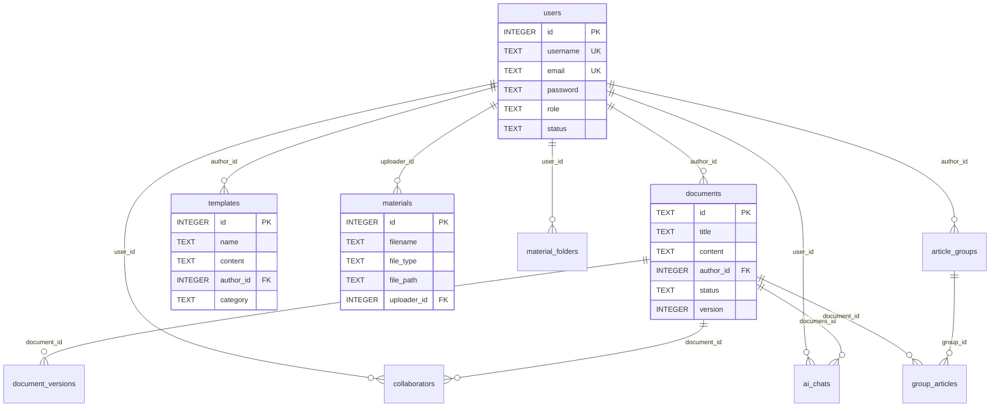

# WXEditor — 数据库设计文档

> 本文档描述 SQLite 数据库的表结构设计，数据库文件位于 `server/data/wxeditor.db`。

## 数据库配置

- **驱动**：`better-sqlite3`（同步 API）
- **WAL 模式**：已启用（提升并发读写性能）
- **外键约束**：已启用（`PRAGMA foreign_keys = ON`）
- **初始化入口**：`server/config/database.js`

## ER 关系图

## 表结构详情

### 1. `users` — 用户表

| 字段 | 类型 | 约束 | 说明 |
|------|------|------|------|
| id | INTEGER | PK, AUTO | 用户 ID |
| username | TEXT | UNIQUE, NOT NULL | 用户名 |
| email | TEXT | UNIQUE, NOT NULL | 邮箱 |
| password | TEXT | NOT NULL | 密码（bcrypt 哈希） |
| nickname | TEXT | DEFAULT '' | 昵称 |
| avatar | TEXT | DEFAULT '' | 头像 URL |
| role | TEXT | CHECK | 角色：`user`/`vip`/`admin`/`superadmin` |
| status | TEXT | CHECK | 状态：`active`/`inactive`/`suspended`/`banned` |
| settings | TEXT | DEFAULT '{}' | 用户配置（JSON） |
| created_at | DATETIME | DEFAULT NOW | 创建时间 |
| updated_at | DATETIME | DEFAULT NOW | 更新时间 |

### 2. `documents` — 文档表

| 字段 | 类型 | 约束 | 说明 |
|------|------|------|------|
| id | TEXT | PK | 文档 ID（UUID） |
| title | TEXT | NOT NULL | 文档标题 |
| content | TEXT | DEFAULT '' | 文档 HTML 内容 |
| summary | TEXT | DEFAULT '' | 文档摘要 |
| author_id | INTEGER | FK → users.id | 作者 |
| cover_image | TEXT | DEFAULT '' | 封面图 URL |
| status | TEXT | CHECK | 状态：`draft`/`published`/`archived`/`deleted` |
| category | TEXT | DEFAULT '' | 分类 |
| tags | TEXT | DEFAULT '[]' | 标签（JSON 数组） |
| version | INTEGER | DEFAULT 1 | 当前版本号 |
| word_count | INTEGER | DEFAULT 0 | 字数统计 |
| wechat_media_id | TEXT | DEFAULT '' | 微信素材 ID |
| wechat_url | TEXT | DEFAULT '' | 微信文章 URL |
| wechat_synced_at | DATETIME | — | 微信同步时间 |
| created_at | DATETIME | DEFAULT NOW | 创建时间 |
| updated_at | DATETIME | DEFAULT NOW | 更新时间 |

### 3. `document_versions` — 文档版本历史表

| 字段 | 类型 | 约束 | 说明 |
|------|------|------|------|
| id | INTEGER | PK, AUTO | 版本 ID |
| document_id | TEXT | FK → documents.id (CASCADE) | 文档 ID |
| version | INTEGER | NOT NULL | 版本号 |
| content | TEXT | DEFAULT '' | 版本内容快照 |
| changed_by | INTEGER | — | 修改人 |
| change_summary | TEXT | DEFAULT '' | 变更说明 |
| created_at | DATETIME | DEFAULT NOW | 创建时间 |

### 4. `collaborators` — 协作者表

| 字段 | 类型 | 约束 | 说明 |
|------|------|------|------|
| id | INTEGER | PK, AUTO | 记录 ID |
| document_id | TEXT | FK → documents.id (CASCADE) | 文档 ID |
| user_id | INTEGER | FK → users.id | 用户 ID |
| role | TEXT | CHECK | 角色：`viewer`/`editor`/`admin` |
| added_at | DATETIME | DEFAULT NOW | 添加时间 |

### 5. `ai_chats` — AI 聊天记录表

| 字段 | 类型 | 约束 | 说明 |
|------|------|------|------|
| id | INTEGER | PK, AUTO | 记录 ID |
| document_id | TEXT | — | 关联文档 ID |
| user_id | INTEGER | — | 用户 ID |
| role | TEXT | CHECK | 消息角色：`user`/`assistant`/`system` |
| content | TEXT | NOT NULL | 消息内容 |
| created_at | DATETIME | DEFAULT NOW | 创建时间 |

### 6. `templates` — 模板表

| 字段 | 类型 | 约束 | 说明 |
|------|------|------|------|
| id | INTEGER | PK, AUTO | 模板 ID |
| name | TEXT | NOT NULL | 模板名称 |
| description | TEXT | DEFAULT '' | 模板描述 |
| category | TEXT | DEFAULT 'general' | 分类 |
| content | TEXT | NOT NULL | 模板 HTML 内容 |
| preview_image | TEXT | DEFAULT '' | 预览图 URL |
| tags | TEXT | DEFAULT '[]' | 标签（JSON 数组） |
| is_public | INTEGER | DEFAULT 0 | 是否公开（0/1） |
| use_count | INTEGER | DEFAULT 0 | 使用次数 |
| author_id | INTEGER | FK → users.id | 作者 |
| status | TEXT | CHECK | 状态：`active`/`inactive`/`deleted` |
| created_at | DATETIME | DEFAULT NOW | 创建时间 |
| updated_at | DATETIME | DEFAULT NOW | 更新时间 |

### 7. `materials` — 素材表

| 字段 | 类型 | 约束 | 说明 |
|------|------|------|------|
| id | INTEGER | PK, AUTO | 素材 ID |
| filename | TEXT | NOT NULL | 存储文件名 |
| original_name | TEXT | NOT NULL | 原始文件名 |
| file_type | TEXT | CHECK | 类型：`image`/`video`/`audio`/`file` |
| file_size | INTEGER | DEFAULT 0 | 文件大小（字节） |
| file_path | TEXT | NOT NULL | 服务器路径 |
| url | TEXT | NOT NULL | 访问 URL |
| mime_type | TEXT | DEFAULT '' | MIME 类型 |
| width | INTEGER | DEFAULT 0 | 图片/视频宽度 |
| height | INTEGER | DEFAULT 0 | 图片/视频高度 |
| duration | INTEGER | DEFAULT 0 | 音视频时长（秒） |
| thumbnail | TEXT | DEFAULT '' | 缩略图 URL |
| uploader_id | INTEGER | FK → users.id | 上传者 |
| folder_id | INTEGER | — | 文件夹 ID |
| is_public | INTEGER | DEFAULT 0 | 是否公开 |
| metadata | TEXT | DEFAULT '{}' | 元数据（JSON） |
| created_at | DATETIME | DEFAULT NOW | 创建时间 |

### 8. `material_folders` — 素材文件夹表

| 字段 | 类型 | 约束 | 说明 |
|------|------|------|------|
| id | INTEGER | PK, AUTO | 文件夹 ID |
| name | TEXT | NOT NULL | 文件夹名称 |
| parent_id | INTEGER | DEFAULT 0 | 父文件夹（0=根目录） |
| user_id | INTEGER | FK → users.id | 所属用户 |
| created_at | DATETIME | DEFAULT NOW | 创建时间 |

### 9. `article_groups` — 图文消息表

| 字段 | 类型 | 约束 | 说明 |
|------|------|------|------|
| id | TEXT | PK | 图文 ID（UUID） |
| title | TEXT | NOT NULL | 图文标题 |
| description | TEXT | DEFAULT '' | 描述 |
| cover_image | TEXT | DEFAULT '' | 封面图 |
| article_count | INTEGER | DEFAULT 0 | 文章数量 |
| author_id | INTEGER | FK → users.id | 作者 |
| status | TEXT | CHECK | 状态：`draft`/`published`/`deleted` |
| wechat_media_id | TEXT | DEFAULT '' | 微信素材 ID |
| created_at | DATETIME | DEFAULT NOW | 创建时间 |
| updated_at | DATETIME | DEFAULT NOW | 更新时间 |

### 10. `group_articles` — 图文-文章关联表

| 字段 | 类型 | 约束 | 说明 |
|------|------|------|------|
| id | INTEGER | PK, AUTO | 记录 ID |
| group_id | TEXT | FK → article_groups.id (CASCADE) | 图文 ID |
| document_id | TEXT | FK → documents.id (CASCADE) | 文档 ID |
| sort_order | INTEGER | DEFAULT 0 | 排序序号 |
| added_at | DATETIME | DEFAULT NOW | 添加时间 |
