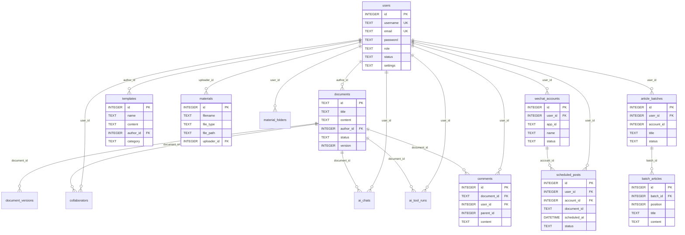

# WXEditor — 数据库设计文档

> 本文档描述 MySQL 数据库的表结构设计，通过 Knex 迁移脚本管理。
>
> **更新日期**：2026-04-16

## 数据库配置

- **驱动**：`mysql2`
- **查询构建器**：Knex（支持迁移 + 种子）
- **配置文件**：`server/knexfile.js`
- **连接入口**：`server/src/config/db.js`
- **字符集**：`utf8mb4`

### 开发环境连接

```javascript
{
  client: 'mysql2',
  connection: {
    host: process.env.DB_HOST || '127.0.0.1',
    port: process.env.DB_PORT || 3306,
    user: process.env.DB_USER || 'root',
    password: process.env.DB_PASSWORD || '',
    database: process.env.DB_NAME || 'wxeditor',
    charset: 'utf8mb4',
  },
  pool: { min: 2, max: 10 },
}
```

### 迁移管理

```bash
# 执行迁移
cd server
npm run migrate

# 回滚
npm run migrate:rollback

# 导入种子数据
npm run seed
```

## 迁移文件

| 文件 | 说明 |
|------|------|
| `001_initial.js` | 初始表结构：users、documents、document_versions、collaborators、ai_chats、templates、materials、material_folders、article_groups、group_articles、teams、team_members、team_invitations、orders、activation_codes、ai_configs、system_settings、roles、permissions、user_roles、analytics_events、scheduled_posts |
| `002_wechat_accounts_comments.js` | 新增：wechat_accounts（公众号管理）、comments（评论批注） |
| `003_article_batches.js` | 新增：article_batches（图文合集）、batch_articles（合集内文章） |
| `004_scheduled_post_logs.js` | 新增：scheduled_post_logs（定时发布执行日志） |
| `005_ai_tool_runs.js` | 新增：ai_tool_runs（AI tool 执行审计） |

## ER 关系图



## 表结构详情

### 1. `users` — 用户表

| 字段 | 类型 | 约束 | 说明 |
|------|------|------|------|
| id | INT | PK, AUTO | 用户 ID |
| username | VARCHAR | UNIQUE, NOT NULL | 用户名 |
| email | VARCHAR | UNIQUE, NOT NULL | 邮箱 |
| password | VARCHAR | NOT NULL | 密码（bcrypt 哈希） |
| nickname | VARCHAR | DEFAULT '' | 昵称 |
| avatar | VARCHAR | DEFAULT '' | 头像 URL |
| role | ENUM | CHECK | 角色：`user`/`vip`/`admin`/`superadmin` |
| status | ENUM | CHECK | 状态：`active`/`inactive`/`suspended`/`banned` |
| settings | JSON | DEFAULT '{}' | 用户配置 |
| password_changed_at | DATETIME | — | 密码最后修改时间 |
| created_at | DATETIME | DEFAULT NOW | 创建时间 |
| updated_at | DATETIME | DEFAULT NOW | 更新时间 |

### 2. `documents` — 文档表

| 字段 | 类型 | 约束 | 说明 |
|------|------|------|------|
| id | VARCHAR(64) | PK | 文档 ID（UUID） |
| title | VARCHAR | NOT NULL | 文档标题 |
| content | LONGTEXT | DEFAULT '' | 文档 HTML 内容 |
| summary | TEXT | DEFAULT '' | 文档摘要 |
| author_id | INT | FK → users.id | 作者 |
| cover_image | VARCHAR | DEFAULT '' | 封面图 URL |
| status | ENUM | CHECK | 状态：`draft`/`published`/`archived`/`deleted` |
| visibility | ENUM | — | `public`/`private`/`members_only`/`vip_only` |
| category | VARCHAR | DEFAULT '' | 分类 |
| tags | JSON | DEFAULT '[]' | 标签 |
| version | INT | DEFAULT 1 | 当前版本号 |
| word_count | INT | DEFAULT 0 | 字数统计 |
| wechat_media_id | VARCHAR | DEFAULT '' | 微信素材 ID |
| wechat_url | VARCHAR | DEFAULT '' | 微信文章 URL |
| wechat_synced_at | DATETIME | — | 微信同步时间 |
| created_at | DATETIME | DEFAULT NOW | 创建时间 |
| updated_at | DATETIME | DEFAULT NOW | 更新时间 |

### 3. `document_versions` — 文档版本历史表

| 字段 | 类型 | 约束 | 说明 |
|------|------|------|------|
| id | INT | PK, AUTO | 版本 ID |
| document_id | VARCHAR(64) | FK → documents.id (CASCADE) | 文档 ID |
| version | INT | NOT NULL | 版本号 |
| content | LONGTEXT | DEFAULT '' | 版本内容快照 |
| changed_by | INT | — | 修改人 |
| change_summary | VARCHAR | DEFAULT '' | 变更说明 |
| created_at | DATETIME | DEFAULT NOW | 创建时间 |

### 4. `collaborators` — 协作者表

| 字段 | 类型 | 约束 | 说明 |
|------|------|------|------|
| id | INT | PK, AUTO | 记录 ID |
| document_id | VARCHAR(64) | FK → documents.id (CASCADE) | 文档 ID |
| user_id | INT | FK → users.id | 用户 ID |
| role | ENUM | CHECK | 角色：`viewer`/`editor`/`admin` |
| added_at | DATETIME | DEFAULT NOW | 添加时间 |

### 5. `ai_chats` — AI 聊天记录表

| 字段 | 类型 | 约束 | 说明 |
|------|------|------|------|
| id | INT | PK, AUTO | 记录 ID |
| document_id | VARCHAR(64) | — | 关联文档 ID |
| user_id | INT | — | 用户 ID |
| role | ENUM | CHECK | 消息角色：`user`/`assistant`/`system` |
| content | TEXT | NOT NULL | 消息内容 |
| created_at | DATETIME | DEFAULT NOW | 创建时间 |

### 6. `ai_tool_runs` — AI Tool 执行审计表

| 字段 | 类型 | 约束 | 说明 |
|------|------|------|------|
| id | INT | PK, AUTO | 记录 ID |
| document_id | VARCHAR(64) | FK → documents.id | 关联文档 ID |
| user_id | INT | FK → users.id | 操作用户 |
| tool_call_id | VARCHAR(128) | — | 模型侧 tool call ID |
| tool_name | VARCHAR(64) | NOT NULL | 工具名称 |
| raw_args | TEXT | NOT NULL | 模型原始参数字符串 |
| normalized_args | TEXT | NOT NULL | 后端收口后的最终参数 |
| reply | TEXT | — | 同轮普通文本回复 |
| model | VARCHAR(255) | — | 生成时使用的模型 |
| created_at | DATETIME | DEFAULT NOW | 创建时间 |

### 7. `templates` — 模板表

| 字段 | 类型 | 约束 | 说明 |
|------|------|------|------|
| id | INT | PK, AUTO | 模板 ID |
| name | VARCHAR | NOT NULL | 模板名称 |
| description | TEXT | DEFAULT '' | 模板描述 |
| category | VARCHAR | DEFAULT 'general' | 分类 |
| content | LONGTEXT | NOT NULL | 模板 HTML 内容 |
| preview_image | VARCHAR | DEFAULT '' | 预览图 URL |
| tags | JSON | DEFAULT '[]' | 标签 |
| is_public | TINYINT | DEFAULT 0 | 是否公开（0/1） |
| use_count | INT | DEFAULT 0 | 使用次数 |
| author_id | INT | FK → users.id | 作者 |
| status | ENUM | CHECK | 状态：`active`/`inactive`/`deleted` |
| created_at | DATETIME | DEFAULT NOW | 创建时间 |
| updated_at | DATETIME | DEFAULT NOW | 更新时间 |

### 8. `materials` — 素材表

| 字段 | 类型 | 约束 | 说明 |
|------|------|------|------|
| id | INT | PK, AUTO | 素材 ID |
| filename | VARCHAR | NOT NULL | 存储文件名 |
| original_name | VARCHAR | NOT NULL | 原始文件名 |
| file_type | ENUM | CHECK | 类型：`image`/`video`/`audio`/`file` |
| file_size | INT | DEFAULT 0 | 文件大小（字节） |
| file_path | VARCHAR | NOT NULL | 服务器路径 |
| url | VARCHAR | NOT NULL | 访问 URL |
| mime_type | VARCHAR | DEFAULT '' | MIME 类型 |
| width | INT | DEFAULT 0 | 图片/视频宽度 |
| height | INT | DEFAULT 0 | 图片/视频高度 |
| duration | INT | DEFAULT 0 | 音视频时长（秒） |
| thumbnail | VARCHAR | DEFAULT '' | 缩略图 URL |
| uploader_id | INT | FK → users.id | 上传者 |
| folder_id | INT | — | 文件夹 ID |
| is_public | TINYINT | DEFAULT 0 | 是否公开 |
| metadata | JSON | DEFAULT '{}' | 元数据 |
| created_at | DATETIME | DEFAULT NOW | 创建时间 |

### 9. `material_folders` — 素材文件夹表

| 字段 | 类型 | 约束 | 说明 |
|------|------|------|------|
| id | INT | PK, AUTO | 文件夹 ID |
| name | VARCHAR | NOT NULL | 文件夹名称 |
| parent_id | INT | DEFAULT 0 | 父文件夹（0=根目录） |
| user_id | INT | FK → users.id | 所属用户 |
| created_at | DATETIME | DEFAULT NOW | 创建时间 |

### 10. `wechat_accounts` — 微信公众号表

| 字段 | 类型 | 约束 | 说明 |
|------|------|------|------|
| id | INT | PK, AUTO | 记录 ID |
| user_id | INT | FK → users.id | 所属用户 |
| app_id | VARCHAR | NOT NULL | 微信 AppID |
| app_secret | VARCHAR | — | 微信 AppSecret（加密存储） |
| name | VARCHAR | NOT NULL | 公众号名称 |
| original_id | VARCHAR | — | 公众号原始 ID |
| status | ENUM | CHECK | 状态：`pending`/`verified`/`disabled` |
| access_token | TEXT | — | 访问令牌 |
| token_expires_at | DATETIME | — | 令牌过期时间 |
| created_at | DATETIME | DEFAULT NOW | 创建时间 |
| updated_at | DATETIME | DEFAULT NOW | 更新时间 |

### 11. `comments` — 评论批注表

| 字段 | 类型 | 约束 | 说明 |
|------|------|------|------|
| id | INT | PK, AUTO | 评论 ID |
| document_id | VARCHAR(64) | FK → documents.id | 文档 ID |
| user_id | INT | FK → users.id | 评论者 |
| parent_id | INT | DEFAULT NULL | 父评论 ID（树形回复） |
| content | TEXT | NOT NULL | 评论内容 |
| status | ENUM | CHECK | 状态：`active`/`resolved`/`deleted` |
| created_at | DATETIME | DEFAULT NOW | 创建时间 |
| updated_at | DATETIME | DEFAULT NOW | 更新时间 |

### 12. `scheduled_posts` — 定时发布表

| 字段 | 类型 | 约束 | 说明 |
|------|------|------|------|
| id | INT | PK, AUTO | 任务 ID |
| user_id | INT | FK → users.id | 创建者 |
| account_id | INT | FK → wechat_accounts.id | 目标公众号 |
| document_id | VARCHAR(64) | — | 关联文档 |
| title | VARCHAR | NOT NULL | 任务标题 |
| scheduled_at | DATETIME | NOT NULL | 计划发布时间 |
| status | ENUM | CHECK | 状态：`pending`/`executing`/`completed`/`failed`/`cancelled` |
| created_at | DATETIME | DEFAULT NOW | 创建时间 |
| updated_at | DATETIME | DEFAULT NOW | 更新时间 |

### 12. `scheduled_post_logs` — 定时发布日志表

| 字段 | 类型 | 约束 | 说明 |
|------|------|------|------|
| id | INT | PK, AUTO | 日志 ID |
| scheduled_post_id | INT | FK → scheduled_posts.id | 关联任务 |
| action | VARCHAR | NOT NULL | 操作类型 |
| status | ENUM | CHECK | 执行状态 |
| message | TEXT | — | 日志消息 |
| created_at | DATETIME | DEFAULT NOW | 创建时间 |

### 13. `article_batches` — 图文合集表

| 字段 | 类型 | 约束 | 说明 |
|------|------|------|------|
| id | INT | PK, AUTO | 合集 ID |
| user_id | INT | FK → users.id | 创建者 |
| account_id | INT | — | 关联公众号 |
| title | VARCHAR | NOT NULL | 合集标题 |
| status | ENUM | CHECK | 状态：`draft`/`published`/`deleted` |
| created_at | DATETIME | DEFAULT NOW | 创建时间 |
| updated_at | DATETIME | DEFAULT NOW | 更新时间 |

### 14. `batch_articles` — 合集内文章表

| 字段 | 类型 | 约束 | 说明 |
|------|------|------|------|
| id | INT | PK, AUTO | 记录 ID |
| batch_id | INT | FK → article_batches.id (CASCADE) | 合集 ID |
| position | INT | NOT NULL | 排序位置 |
| title | VARCHAR | NOT NULL | 文章标题 |
| content | LONGTEXT | — | 文章内容 |
| cover_image | VARCHAR | — | 封面图 |
| digest | VARCHAR | — | 摘要 |
| author | VARCHAR | — | 作者 |
| word_count | INT | DEFAULT 0 | 字数 |
| created_at | DATETIME | DEFAULT NOW | 创建时间 |
| updated_at | DATETIME | DEFAULT NOW | 更新时间 |

### 15. `teams` — 团队表

| 字段 | 类型 | 约束 | 说明 |
|------|------|------|------|
| id | VARCHAR(64) | PK | 团队 ID（UUID） |
| name | VARCHAR | NOT NULL | 团队名称 |
| description | TEXT | DEFAULT '' | 描述 |
| owner_id | INT | FK → users.id | 创建者 |
| created_at | DATETIME | DEFAULT NOW | 创建时间 |
| updated_at | DATETIME | DEFAULT NOW | 更新时间 |

### 16. `team_members` — 团队成员表

| 字段 | 类型 | 约束 | 说明 |
|------|------|------|------|
| id | INT | PK, AUTO | 记录 ID |
| team_id | VARCHAR(64) | FK → teams.id | 团队 ID |
| user_id | INT | FK → users.id | 用户 ID |
| role | ENUM | CHECK | 角色：`owner`/`admin`/`member` |
| joined_at | DATETIME | DEFAULT NOW | 加入时间 |

### 17. `team_invitations` — 团队邀请表

| 字段 | 类型 | 约束 | 说明 |
|------|------|------|------|
| id | INT | PK, AUTO | 记录 ID |
| team_id | VARCHAR(64) | FK → teams.id | 团队 ID |
| email | VARCHAR | NOT NULL | 被邀请者邮箱 |
| code | VARCHAR | UNIQUE | 邀请码 |
| role | ENUM | — | 预设角色 |
| status | ENUM | CHECK | 状态：`pending`/`accepted`/`rejected`/`expired` |
| created_at | DATETIME | DEFAULT NOW | 创建时间 |

### 18-21. 其他表

| 表名 | 说明 |
|------|------|
| `orders` | 订单表（会员订阅/支付） |
| `activation_codes` | 激活码表 |
| `ai_configs` | AI 配置表（供应商/模型/参数） |
| `system_settings` | 系统设置表（key-value） |
| `roles` | 角色定义表 |
| `permissions` | 权限定义表 |
| `user_roles` | 用户-角色关联表 |
| `analytics_events` | 分析事件表 |
| `article_groups` | 图文消息组表（旧版） |
| `group_articles` | 图文-文章关联表（旧版） |

## 种子数据

| 文件 | 说明 |
|------|------|
| `seeds/001_admin.js` | 创建超级管理员账号 |
| `seeds/002_templates.js` | 导入预设排版模板 |
