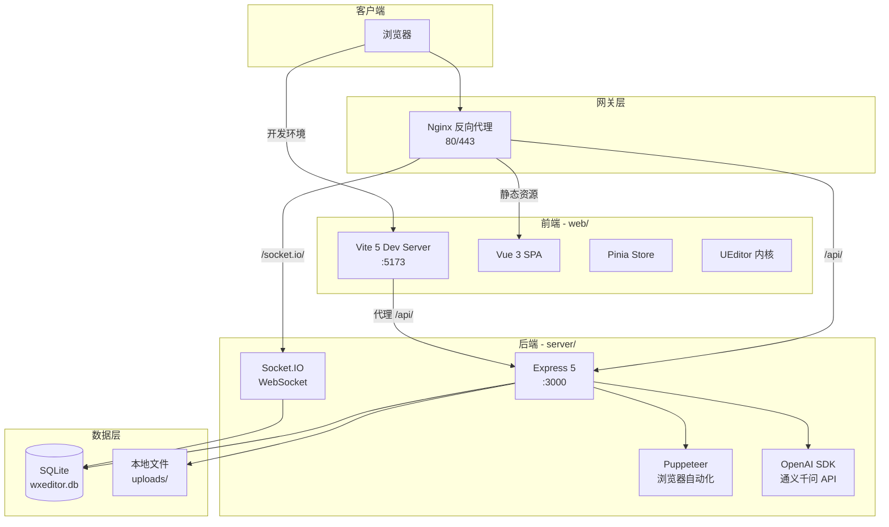

# WXEditor — 项目结构与架构说明

> 本文档描述项目的物理文件结构、分层架构和服务间调用关系，便于开发者快速了解全栈脉络。

## 1. 宏观技术架构

本项目采用**完全前后端分离**架构，通过 Docker Compose 编排部署。



### 架构层级说明

| 层级 | 技术栈 | 职责 |
|------|--------|------|
| **前端展现层** | Vue 3 + Vite + Element Plus + Pinia | SPA 界面、状态管理、路由守卫 |
| **富文本核心层** | UEditor 定制版 | 选区操作、排版工具、可视化编辑 |
| **网关代理层** | Nginx | 反向代理、静态资源、WebSocket 升级 |
| **API 接口层** | Express 5 | RESTful API、JWT 认证、路由分发 |
| **实时通信层** | Socket.IO | WebSocket 连接池、编辑锁、增量广播 |
| **AI 服务层** | OpenAI SDK（Dashscope） | 文章润色/改写/标题/摘要生成 |
| **自动化层** | Puppeteer | 模拟微信登录、草稿上传 |
| **数据持久层** | SQLite（better-sqlite3） | 用户/文档/模板/素材/订单存储 |

## 2. 目录结构

```
wxeditor-server/                          # 项目根目录
├── package.json                          # 根级启动脚本
├── docker-compose.yml                    # Docker 容器编排
├── nginx.conf                            # Nginx 配置
├── docs/                                 # 📚 项目文档
│   ├── PRD.md                            #   产品需求文档
│   ├── PROJECT_STRUCTURE.md              #   本文档
│   ├── TECH_STACK.md                     #   技术栈详情
│   ├── DATABASE.md                       #   数据库设计
│   ├── DEPLOYMENT.md                     #   部署指南
│   ├── FRONTEND_ARCHITECTURE.md          #   前端架构
│   ├── BACKEND_ARCHITECTURE.md           #   后端架构
│   ├── AI_INTEGRATION.md                 #   AI 集成文档
│   └── CHANGELOG.md                      #   变更日志
│
├── web/                                  # 🟢 前端项目（Vue 3 + Vite）
│   ├── package.json                      #   前端依赖
│   ├── vite.config.ts                    #   Vite 配置 + API 代理
│   ├── tsconfig.json                     #   TypeScript 配置
│   ├── index.html                        #   SPA 入口
│   ├── public/                           #   纯静态资源
│   └── src/
│       ├── main.ts                       #   应用入口
│       ├── App.vue                       #   根组件
│       ├── api/                          #   HTTP 请求封装
│       │   ├── index.ts                  #     API 接口定义
│       │   └── http.ts                   #     Axios 实例
│       ├── components/                   #   组件目录
│       │   ├── ai/                       #     AI 聊天面板
│       │   ├── base/                     #     基础组件（StickyNote/FlatButton 等）
│       │   ├── collab/                   #     协作组件
│       │   ├── common/                   #     通用组件
│       │   ├── editor/                   #     编辑器组件
│       │   └── sidebar/                  #     侧边栏组件
│       ├── composables/                  #   Vue 组合函数
│       ├── layouts/                      #   页面布局
│       ├── router/index.ts               #   路由定义与守卫
│       ├── stores/                       #   Pinia 状态管理
│       │   ├── ai.ts                     #     AI 聊天状态
│       │   ├── editor.ts                 #     编辑器状态
│       │   ├── theme.ts                  #     主题状态
│       │   ├── user.ts                   #     用户状态
│       │   └── index.ts                  #     Store 入口
│       ├── styles/                       #   全局样式
│       │   ├── ueditor-flat.css          #     UEditor 波普风格主题
│       │   └── ueditor-icons.css         #     UEditor 图标样式
│       ├── types/                        #   TypeScript 类型
│       ├── utils/                        #   工具函数
│       └── views/                        #   页面视图
│           ├── EditorView.vue            #     编辑器页面
│           ├── ProjectsView.vue          #     项目管理
│           ├── TemplatesView.vue         #     模板库
│           ├── ComponentsView.vue        #     组件库
│           ├── NotFoundView.vue          #     404 页面
│           ├── auth/                     #     认证页面
│           │   ├── LoginView.vue         #       登录
│           │   └── RegisterView.vue      #       注册
│           ├── membership/               #     会员页面
│           │   ├── PricingView.vue       #       定价
│           │   ├── CheckoutView.vue      #       结算
│           │   └── MembershipView.vue    #       会员中心
│           └── teams/                    #     团队页面
│               ├── TeamsView.vue         #       团队列表
│               ├── TeamDetailView.vue    #       团队详情
│               └── InvitationsView.vue   #       邀请管理
│
└── server/                               # 🔵 后端服务（Node.js + Express）
    ├── package.json                      #   后端依赖
    ├── app.js                            #   Express 主入口
    ├── .env / .env.example               #   环境变量
    ├── config/
    │   └── database.js                   #   SQLite 初始化与建表
    ├── config.json                       #   UEditor 服务端配置
    ├── data/
    │   └── wxeditor.db                   #   SQLite 数据库文件
    ├── models/                           #   数据模型
    │   ├── User.js                       #     用户模型
    │   ├── Document.js                   #     文档模型
    │   ├── Folder.js                     #     文件夹模型
    │   ├── Team.js                       #     团队模型
    │   ├── TeamInvitation.js             #     团队邀请
    │   ├── Order.js                      #     订单模型
    │   └── index.js                      #     模型入口
    ├── routes/                           #   API 路由（13 个模块）
    │   ├── auth.js                       #     用户认证
    │   ├── ai.js                         #     AI 功能
    │   ├── collaboration.js              #     协作管理
    │   ├── content.js                    #     内容管理
    │   ├── ueditor.js                    #     UEditor 接口
    │   ├── wechat.js                     #     微信登录
    │   ├── wechat-content.js             #     微信内容转换
    │   ├── draft.js                      #     草稿管理
    │   ├── templates.js                  #     模板管理
    │   ├── materials.js                  #     素材管理
    │   ├── team.js                       #     团队管理
    │   ├── membership.js                 #     会员管理
    │   └── admin.js                      #     管理后台
    ├── services/
    │   └── collaboration.js              #   协作 WebSocket 服务
    ├── middleware/
    │   ├── auth.js                       #   JWT 认证中间件
    │   └── admin/                        #   管理员中间件
    ├── utils/
    │   ├── helpers.js                    #   通用工具函数
    │   └── styleConverter.js             #   CSS → 内联样式转换
    ├── public/
    │   ├── uploads/                      #   上传文件存储
    │   └── ueditor/                      #   UEditor 静态资源
    ├── views/                            #   后端预留视图模板
    ├── images/                           #   静态图片
    └── docs/                             #   后端文档
        ├── design-system.md              #     UI 设计系统
        ├── api/endpoints.md              #     API 端点文档
        └── user-flows/                   #     用户流程文档
            ├── auth-flow.md              #       认证流程
            ├── document-flow.md          #       文档流程
            ├── team-flow.md              #       团队流程
            └── membership-flow.md        #       会员流程
```

## 3. 关键系统流转

### 3.1 前后端通信

```
┌─────────────────────────────────────────────────────────┐
│ 开发环境                                                 │
│   浏览器 → Vite(:5173) ──代理 /api/→ Express(:3000)     │
│                          ──代理 /uploads/→ Express       │
├─────────────────────────────────────────────────────────┤
│ 生产环境                                                 │
│   浏览器 → Nginx(:80) ──/api/→ Express(:3000)           │
│                        ──/socket.io/→ Express (ws升级)   │
│                        ──/→ 静态 HTML                    │
└─────────────────────────────────────────────────────────┘
```

- **开发环境**：Vite `server.proxy` 将 `/api/` 和 `/uploads/` 转发至后端 `http://localhost:3000`
- **生产环境**：Nginx 负责路由分发，`/api/` 和 `/socket.io/` 代理到 Node 服务

### 3.2 微信发布流程

```
前端触发"同步" → routes/wechat.js → 校验登录状态 → Puppeteer 后台进程
→ 上传 uploads 素材至微信素材库 → 替换 HTML 中的图片链接
→ 调用微信内部接口 → 内容投递至公众号草稿箱
```

### 3.3 AI 对话流程

```
前端 AI 面板 → Pinia AIStore → Dashscope API（前端直连）
                             → /api/ai/chat（后端转发，支持历史存储）
→ 返回回复 → 提取代码块 → 可一键插入编辑器
```

### 3.4 协作编辑流程

```
用户 A 编辑 → Socket.IO → 服务端 CollaborationService
→ 版本检查 + 编辑锁 → 广播 document-updated → 用户 B/C 同步更新
```
