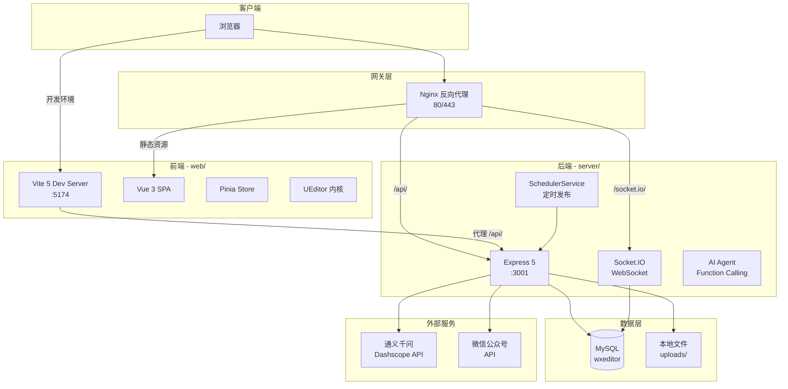

# WXEditor — 项目结构与架构说明

> 本文档描述项目的物理文件结构、分层架构和服务间调用关系，便于开发者快速了解全栈脉络。
>
> **更新日期**：2026-04-15

## 1. 宏观技术架构

本项目采用**完全前后端分离**架构，后端遵循 **Clean Architecture** 分层，通过 Docker Compose 编排部署。



### 架构层级说明

| 层级 | 技术栈 | 职责 |
|------|--------|------|
| **前端展现层** | Vue 3 + Vite + Element Plus + Pinia | SPA 界面、状态管理、路由守卫 |
| **富文本核心层** | UEditor 定制版 | 选区操作、排版工具、可视化编辑 |
| **网关代理层** | Nginx | 反向代理、静态资源、WebSocket 升级 |
| **API 接口层** | Express 5（Controllers） | RESTful API、JWT 认证、路由分发 |
| **业务逻辑层** | Services | 核心业务处理、事务管理 |
| **数据访问层** | Repositories（Knex） | SQL 查询、数据映射 |
| **实时通信层** | Socket.IO | WebSocket 连接池、编辑锁、增量广播 |
| **AI 服务层** | OpenAI SDK（Dashscope） | SSE 流式对话、Function Calling、文章润色 |
| **调度服务层** | SchedulerService | 定时发布、任务调度 |
| **数据持久层** | MySQL（Knex + mysql2） | 用户/文档/模板/素材/订单/评论/定时任务存储 |

## 2. 目录结构

```
wxeditor-server-new/                      # 项目根目录
├── package.json                          # 根级启动脚本（concurrently）
├── docker-compose.yml                    # Docker 容器编排（PG + 后端 + 前端 + Nginx）
├── nginx.conf                            # Nginx 配置
├── docs/                                 # 📚 项目文档
│   ├── README.md                         #   文档总索引与阅读顺序
│   ├── PRD.md / pages.md                 #   产品与页面说明
│   ├── PROJECT_STRUCTURE.md              #   本文档
│   ├── TECH_STACK.md                     #   技术栈详情
│   ├── FRONTEND_ARCHITECTURE.md          #   前端架构
│   ├── BACKEND_ARCHITECTURE.md           #   后端架构
│   ├── DATABASE.md / API_CONTRACT.md     #   数据与接口契约
│   ├── DEPLOYMENT.md                     #   本地开发与部署指南
│   ├── AI_INTEGRATION.md                 #   当前 AI 主链路
│   ├── AI_AGENT_ARCHITECTURE.md          #   AI 演进路线
│   ├── COMMERCIAL.md / GTM.md            #   商业化与增长
│   ├── navigation-system.md              #   导航系统专项说明
│   ├── CHANGELOG.md / TEST_REPORT.md     #   变更与测试快照
│   └── plans/                            #   阶段性实施计划
│       └── 2026-04-13-phase3-features.md
│
├── web/                                  # 🟢 前端项目（Vue 3 + Vite）
│   ├── package.json                      #   前端依赖
│   ├── vite.config.ts                    #   Vite 配置（API 代理 → :3001）
│   ├── tsconfig.json                     #   TypeScript 配置
│   ├── index.html                        #   SPA 入口
│   ├── playwright.config.ts              #   E2E 测试配置
│   ├── public/                           #   纯静态资源
│   │   └── ueditor/                      #     UEditor 静态文件
│   └── src/
│       ├── main.ts                       #   应用入口
│       ├── App.vue                       #   根组件
│       ├── api/                          #   HTTP 请求封装
│       │   └── index.ts                  #     API 接口定义
│       ├── components/                   #   组件目录
│       │   ├── base/                     #     基础组件（AppButton/FlatButton/StickyNote/PopCard/PaperInput/EmptyState）
│       │   ├── editor/                   #     编辑器组件（CommentPanel/CommentItem）
│       │   ├── navigation/              #     导航组件（BackButton/Breadcrumb/Logo/PageTransition）
│       │   ├── GlobalNav.vue            #     全局导航栏
│       │   └── UpgradeModal.vue         #     升级弹窗
│       ├── i18n/                         #   国际化
│       ├── layouts/                      #   页面布局
│       │   ├── DashboardLayout.vue      #     仪表盘布局
│       │   ├── EditorLayout.vue         #     编辑器布局
│       │   ├── AdminLayout.vue          #     管理后台布局
│       │   └── WorkspaceLayout.vue      #     工作区布局
│       ├── router/index.ts              #   路由定义与守卫
│       ├── stores/                       #   Pinia 状态管理
│       │   ├── ai.ts                    #     AI 聊天状态
│       │   ├── editor.ts                #     编辑器状态
│       │   ├── theme.ts                 #     主题状态
│       │   ├── user.ts                  #     用户状态
│       │   ├── navigation.ts            #     导航状态
│       │   ├── wechat.ts                #     微信状态
│       │   ├── app.ts                   #     应用全局状态
│       │   └── index.ts                 #     Store 入口
│       ├── styles/                       #   全局样式
│       ├── types/                        #   TypeScript 类型
│       ├── utils/                        #   工具函数
│       └── views/                        #   页面视图
│           ├── HomeView.vue             #     官网首页
│           ├── DashboardHomeView.vue    #     仪表盘首页
│           ├── EditorView.vue           #     编辑器页面
│           ├── ProjectsView.vue         #     项目管理
│           ├── TemplatesView.vue        #     模板库
│           ├── MaterialsView.vue        #     素材库
│           ├── ComponentsView.vue       #     组件库
│           ├── ProfileView.vue          #     个人中心
│           ├── NotFoundView.vue         #     404 页面
│           ├── auth/                    #     认证页面
│           │   ├── LoginView.vue
│           │   ├── RegisterView.vue
│           │   └── WechatCallbackView.vue
│           ├── membership/              #     会员页面
│           │   ├── PricingView.vue
│           │   ├── CheckoutView.vue
│           │   └── MembershipView.vue
│           ├── teams/                   #     团队页面
│           │   ├── TeamsView.vue
│           │   ├── TeamDetailView.vue
│           │   └── InvitationsView.vue
│           ├── wechat/                  #     微信公众号
│           │   └── WechatAccountsView.vue
│           ├── scheduled/               #     定时发布
│           │   ├── ScheduledPostsView.vue
│           │   └── ScheduledPostCreateView.vue
│           ├── articles/                #     图文合集
│           │   ├── BatchListView.vue
│           │   └── BatchEditorView.vue
│           └── admin/                   #     管理后台
│               ├── DashboardView.vue
│               ├── UsersView.vue
│               ├── MembershipView.vue
│               ├── ProductsView.vue
│               ├── ContentReviewView.vue
│               ├── CommentsView.vue
│               ├── WechatAccountsView.vue
│               ├── AIConfigView.vue
│               ├── AnalyticsView.vue
│               └── SettingsView.vue
│
└── server/                               # 🔵 后端服务（Node.js + Express, Clean Architecture）
    ├── package.json                      #   后端依赖（v2.0.0）
    ├── knexfile.js                       #   Knex 配置（MySQL）
    ├── jest.config.js                    #   Jest 测试配置
    ├── migrations/                       #   数据库迁移
    │   ├── 001_initial.js               #     初始表结构
    │   ├── 002_wechat_accounts_comments.js  #  公众号 + 评论
    │   ├── 003_article_batches.js       #     图文合集
    │   └── 004_scheduled_post_logs.js   #     定时发布日志
    ├── seeds/                            #   种子数据
    │   ├── 001_admin.js                 #     管理员账号
    │   └── 002_templates.js             #     预设模板
    ├── src/
    │   ├── app.js                       #   Express 主入口（HTTP/Socket/Scheduler）
    │   ├── config/
    │   │   └── db.js                    #     Knex 数据库连接
    │   ├── routes/
    │   │   └── index.js                 #     路由聚合注册（18 个模块）
    │   ├── controllers/                 #   控制器层（HTTP 请求处理）
    │   │   ├── auth.ctrl.js             #     用户认证
    │   │   ├── content.ctrl.js          #     内容管理
    │   │   ├── collab.ctrl.js           #     协作文档
    │   │   ├── template.ctrl.js         #     模板管理
    │   │   ├── material.ctrl.js         #     素材管理
    │   │   ├── membership.ctrl.js       #     会员管理
    │   │   ├── team.ctrl.js             #     团队管理
    │   │   ├── ai.ctrl.js               #     AI 对话/改写
    │   │   ├── aiAgent.ctrl.js          #     AI Agent
    │   │   ├── aiConfig.ctrl.js         #     AI 配置管理
    │   │   ├── ueditor.ctrl.js          #     UEditor 上传
    │   │   ├── wechat.ctrl.js           #     微信登录
    │   │   ├── wechatAccount.ctrl.js    #     多公众号管理
    │   │   ├── draft.ctrl.js            #     草稿/微信发布
    │   │   ├── scheduledPost.ctrl.js    #     定时发布
    │   │   ├── comment.ctrl.js          #     评论批注
    │   │   ├── articleBatch.ctrl.js     #     图文合集
    │   │   └── admin.ctrl.js            #     管理后台
    │   ├── services/                    #   服务层（业务逻辑）
    │   │   ├── auth.service.js
    │   │   ├── content.service.js
    │   │   ├── document.service.js
    │   │   ├── template.service.js
    │   │   ├── material.service.js
    │   │   ├── membership.service.js
    │   │   ├── team.service.js
    │   │   ├── aiAgent.service.js
    │   │   ├── admin.service.js
    │   │   ├── wechatAccount.service.js
    │   │   ├── wechatOAuth.service.js
    │   │   ├── wechatProxy.service.js
    │   │   ├── scheduledPost.service.js
    │   │   ├── scheduledPostLog.service.js
    │   │   ├── scheduler.service.js
    │   │   ├── comment.service.js
    │   │   └── articleBatch.service.js
    │   ├── repositories/                #   仓储层（数据访问）
    │   │   ├── user.repo.js
    │   │   ├── content.repo.js
    │   │   ├── document.repo.js
    │   │   ├── template.repo.js
    │   │   ├── material.repo.js
    │   │   ├── wechatAccount.repo.js
    │   │   ├── scheduledPost.repo.js
    │   │   ├── scheduledPostLog.repo.js
    │   │   ├── comment.repo.js
    │   │   └── articleBatch.repo.js
    │   ├── middleware/                  #   中间件
    │   │   ├── auth.js                  #     JWT 认证
    │   │   ├── rbac.js                  #     角色权限控制
    │   │   └── wechat-auth.js           #     微信鉴权
    │   ├── sockets/
    │   │   └── index.js                 #   WebSocket 协作服务
    │   ├── ai/                          #   AI 模块
    │   │   ├── index.js                 #     AI 入口
    │   │   ├── tools.js                 #     Function Calling 工具
    │   │   ├── prompts.js               #     提示词模板
    │   │   └── formatter.js             #     输出格式化
    │   └── utils/                       #   工具函数
    │       ├── helpers.js
    │       └── sanitize.js
    └── tests/                            #   API 测试
        ├── setup.js
        ├── auth.test.js
        ├── documents.test.js
        ├── templates.test.js
        └── aiAgent.test.js
```

## 3. 关键系统流转

### 3.1 前后端通信

```
┌─────────────────────────────────────────────────────────┐
│ 开发环境                                                 │
│   浏览器 → Vite(:5174) ──代理 /api/→ Express(:3001)     │
│                          ──代理 /uploads/→ Express       │
├─────────────────────────────────────────────────────────┤
│ 生产环境                                                 │
│   浏览器 → Nginx(:80) ──/api/→ Express(:3001)           │
│                        ──/socket.io/→ Express (ws升级)   │
│                        ──/→ 静态 HTML                    │
└─────────────────────────────────────────────────────────┘
```

- **开发环境**：Vite `server.proxy` 将 `/api/` 和 `/uploads/` 转发至后端 `http://localhost:3001`
- **生产环境**：Nginx 负责路由分发，`/api/` 和 `/socket.io/` 代理到 Node 服务

### 3.2 后端请求处理链（Clean Architecture）

```
HTTP 请求
  → Express 中间件（CORS / 限流 / 日志 / Body解析）
  → 路由匹配（routes/index.js）
  → Controller（参数校验、响应格式化）
  → Service（业务逻辑、事务管理）
  → Repository（Knex SQL 查询）
  → MySQL 数据库
```

### 3.3 AI 对话流程

```
前端 AI 面板 → POST /api/ai/chat（SSE）
→ ai.ctrl.js → Dashscope API（OpenAI 兼容协议）
→ SSE 流式返回 → 前端逐字渲染
→ 对话记录存储至 ai_chats 表

AI Agent 流程:
前端 → POST /api/ai-agent/* → aiAgent.ctrl.js
→ aiAgent.service.js → ai/tools.js（Function Calling）
→ ai/prompts.js（提示词模板）→ ai/formatter.js（格式化输出）
```

### 3.4 协作编辑流程

```
用户 A 编辑 → Socket.IO → 服务端 sockets/index.js
→ 版本检查 + 编辑锁 → 广播 document-updated → 用户 B/C 同步更新
```

### 3.5 定时发布流程

```
用户创建定时任务 → scheduledPost.ctrl.js → scheduledPost.service.js → DB
→ SchedulerService 在 app.js 启动后轮询
→ 到达发布时间 → 调用微信 API 发布
→ scheduledPostLog 记录执行结果
```

### 3.6 微信公众号发布流程

```
前端触发"同步" → drafts/upload → draft.ctrl.js
→ 校验公众号绑定状态 → wechatProxy.service.js
→ 上传素材至微信素材库 → 替换 HTML 中的图片链接
→ 调用微信 API → 内容投递至公众号草稿箱
```
