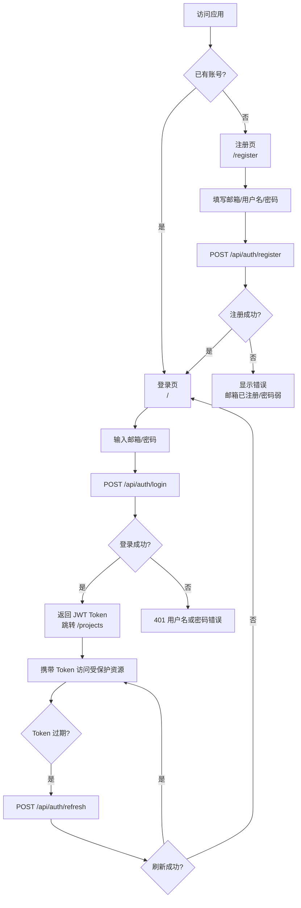

# 用户认证流程

> 本文档描述用户注册、登录、Token 刷新和密码重置的完整流程。

## 流程图



## 1. 注册流程

**端点**：`POST /api/auth/register`

**请求**：
```json
{ "username": "user1", "email": "user@example.com", "password": "P@ssw0rd!" }
```

**处理步骤**：
1. 校验必填字段（username、email、password）
2. 校验邮箱格式和密码强度
3. 检查 username/email 唯一性
4. 使用 bcryptjs 对密码哈希
5. 插入 `users` 表，默认角色 `user`，状态 `active`
6. 返回用户信息（不含密码）

**响应**：201 Created

**错误场景**：
| 状态码 | 说明 |
|--------|------|
| 400 | 参数校验失败 |
| 409 | 邮箱/用户名已注册 |

## 2. 登录流程

**端点**：`POST /api/auth/login`

**请求**：
```json
{ "email": "user@example.com", "password": "P@ssw0rd!" }
```

**处理步骤**：
1. 校验邮箱和密码非空
2. 查询用户（按 email 或 username）
3. bcryptjs 比对密码
4. 检查用户状态（非 `banned`/`suspended`）
5. 生成 Access Token（JWT_EXPIRES_IN，默认 7d）
6. 生成 Refresh Token（JWT_REFRESH_EXPIRES_IN，默认 30d）
7. 前端存储 Token 到 `localStorage`

**响应**：200 OK
```json
{ "success": true, "data": { "accessToken": "...", "refreshToken": "...", "user": { "id": 1, "username": "...", "role": "user" } } }
```

**错误场景**：
| 状态码 | 说明 |
|--------|------|
| 401 | 用户名或密码错误 |
| 403 | 账号被禁用 |

## 3. Token 刷新

**端点**：`POST /api/auth/refresh`

**请求**：
```json
{ "refreshToken": "eyJhbGci..." }
```

**处理步骤**：
1. 验证 Refresh Token 签名和有效期
2. 提取用户 ID
3. 生成新的 Access Token 和 Refresh Token
4. 返回新令牌对

**错误场景**：
| 状态码 | 说明 |
|--------|------|
| 401 | Refresh Token 无效或过期 |

## 4. 路由守卫（前端）

```typescript
// web/src/router/index.ts
router.beforeEach((to, _from, next) => {
  const requiresAuth = to.matched.some(r => r.meta?.requiresAuth);
  const token = localStorage.getItem('token');
  if (requiresAuth && !token) {
    next({ name: 'Login' });
  } else {
    next();
  }
});
```

## 5. JWT 中间件（后端）

```javascript
// server/middleware/auth.js
// verifyToken - 验证 Authorization 头中的 Bearer Token
// requireRole(role) - 检查用户角色
```

## 6. 安全要点

| 要点 | 说明 |
|------|------|
| 密码存储 | bcryptjs 哈希，不存明文 |
| Token 签名 | 使用 `JWT_SECRET` 和 `JWT_REFRESH_SECRET` 独立密钥 |
| 前端存储 | `localStorage`（建议生产环境迁移至 HttpOnly Cookie） |
| CSRF 防护 | 建议添加 CSRF Token 机制 |
