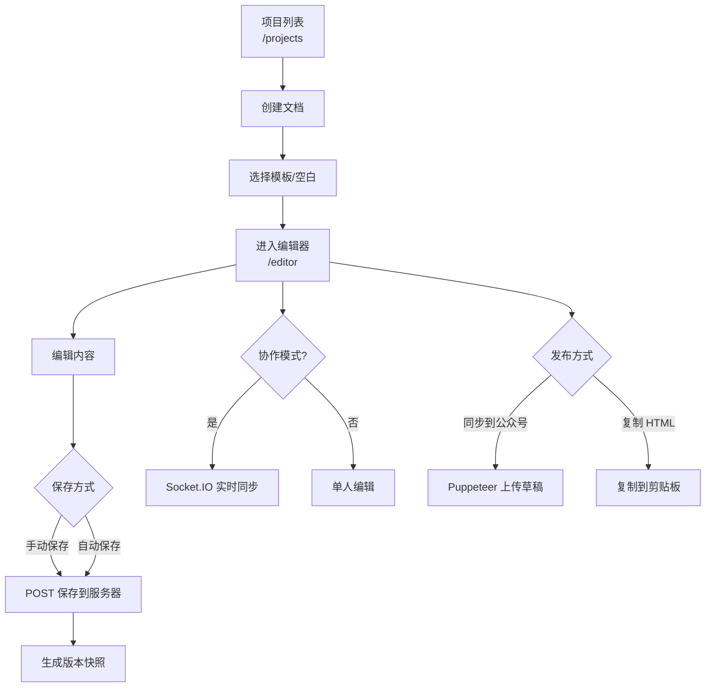
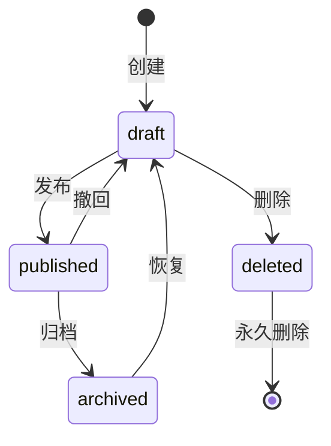

# 文档管理流程

> 本文档描述文档的创建、编辑、保存、分享和删除的完整流程。

## 流程图

## 1. 创建文档

**触发**：项目管理页点击"创建文档"

**流程**：
1. 用户选择模板或空白文档
2. 输入文档标题
3. 调用 API 创建文档记录（`documents` 表）
4. 返回文档 ID，跳转至编辑器页面

**数据库记录**：
- `status`: `draft`
- `version`: 1
- `author_id`: 当前用户 ID

## 2. 编辑文档

### 单人编辑

1. 通过 API 加载文档内容
2. UEditor 渲染内容
3. 用户编辑（富文本操作）
4. 内容变更触发保存

### 多人协作编辑

1. 通过 Socket.IO `join-document` 加入文档房间
2. 获取当前文档内容和在线用户列表
3. 请求编辑权限（悲观锁模式）
4. 编辑内容通过 `document-change` 事件广播
5. 其他用户收到 `document-updated` 事件同步

### 编辑锁机制

| 模式 | 说明 |
|------|------|
| **悲观锁**（默认） | 同一时刻仅一人可编辑，通过 `request-edit` / `edit-granted` 控制 |
| **乐观锁** | 多人同时编辑，基于版本号检测冲突 |

编辑锁超时：30 秒无操作自动释放。

## 3. 保存文档

**端点**：`PUT /api/collab/documents/:id`

**处理步骤**：
1. 接收文档内容和版本号
2. 校验版本号（冲突检测）
3. 更新 `documents` 表内容
4. 递增 `version` 字段
5. 在 `document_versions` 表创建版本快照
6. 更新 `word_count` 和 `updated_at`

**错误场景**：
| 状态码 | 说明 |
|--------|------|
| 404 | 文档不存在 |
| 409 | 版本冲突 |

## 4. 分享文档

**端点**：`POST /api/collab/documents/:id/share`

**流程**：
1. 用户进入分享设置
2. 选择分享权限（查看/编辑）
3. 生成分享链接
4. 被邀请者通过链接加入协作

## 5. 删除文档

**端点**：`DELETE /api/collab/documents/:id`

**流程**：
1. 确认删除操作
2. 更新文档状态为 `deleted`（软删除）
3. 更新项目列表视图

## 6. 文档状态流转

## 7. 微信发布流程

1. 编辑完成，点击"同步到公众号"
2. 检查微信登录状态
3. HTML 内容经过净化处理（sanitize-html + styleConverter）
4. 图片上传至微信素材库，替换 URL
5. 调用微信接口创建草稿
6. 更新 `wechat_media_id` 和 `wechat_synced_at`
