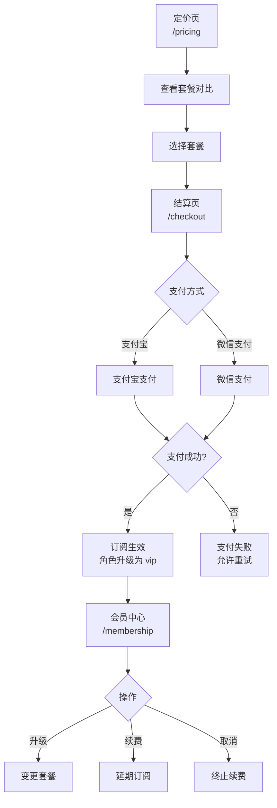

# 订阅与会员体系流程

> 本文档描述会员套餐查看、订阅、结算支付、升降级和取消的完整流程。

## 流程图



## 1. 查看定价

**页面**：`/pricing`（`PricingView.vue`）

**内容**：
- 各套餐功能对比
- 月付/年付切换
- 免费试用入口
- 折扣和优惠信息

**端点**：`GET /api/membership/plans`

## 2. 选择套餐

**流程**：
1. 用户选择目标套餐
2. 选择结算周期（月/年）
3. 跳转到结算页

## 3. 结算支付

**页面**：`/checkout`（`CheckoutView.vue`，需登录）

**端点**：`POST /api/membership/checkout`

**请求**：
```json
{
  "planId": "pro",
  "period": "monthly",
  "paymentMethod": "alipay"
}
```

**处理**：
1. 校验套餐有效性
2. 计算总价（含优惠/折扣）
3. 集成支付网关（支付宝/微信支付）
4. 创建订单记录（`Order` 模型）
5. 支付成功后更新用户角色为 `vip`
6. 创建订阅记录

## 4. 会员管理

**页面**：`/membership`（`MembershipView.vue`，需登录）

**端点**：`GET /api/membership/current`

**展示信息**：
- 当前套餐和到期日期
- 用量统计（文档数、素材空间等）
- 升级/续费/取消入口
- 账单历史

## 5. 升级/降级

**端点**：`POST /api/membership/upgrade`

**请求**：
```json
{ "newPlanId": "enterprise" }
```

**处理**：
1. 计算套餐差价
2. 补差价或退差额
3. 即时更新权限和配额

## 6. 取消订阅

**端点**：`DELETE /api/membership/cancel`

**处理**：
1. 确认取消意愿
2. 禁用自动续费
3. 保留权限至当前订阅期结束
4. 期满后角色降级为 `user`

## 7. 用户角色与权限

| 角色 | 说明 | 配额示例 |
|------|------|----------|
| `user` | 免费用户 | 基础功能，有限文档数 |
| `vip` | 付费会员 | 全部功能，扩展配额 |
| `admin` | 管理员 | 全部功能 + 管理后台 |
| `superadmin` | 超级管理员 | 无限制 |

## 8. 前端页面

| 路由 | 视图 | 认证 | 说明 |
|------|------|------|------|
| `/pricing` | `PricingView.vue` | 否 | 定价页（可公开访问） |
| `/checkout` | `CheckoutView.vue` | 是 | 结算页 |
| `/membership` | `MembershipView.vue` | 是 | 会员中心 |
