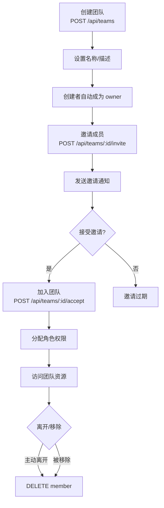

# 团队协作流程

> 本文档描述团队创建、成员邀请、权限管理和离开团队的流程。

## 流程图



## 1. 创建团队

**端点**：`POST /api/teams`

**请求**：
```json
{ "name": "运营团队", "description": "微信公众号运营小组" }
```

**处理**：
1. 校验团队名称（非空、唯一性）
2. 创建团队记录
3. 将创建者设为 `owner` 角色
4. 返回团队 ID

## 2. 邀请成员

**端点**：`POST /api/teams/:id/invite`

**请求**：
```json
{ "email": "member@example.com", "role": "member" }
```

**处理**：
1. 验证操作者为 owner 或 admin
2. 检查被邀请者是否为系统用户
3. 生成邀请码（唯一标识）
4. 创建邀请记录（`TeamInvitation` 模型）
5. 发送邀请通知

**角色选项**：
| 角色 | 权限 |
|------|------|
| `owner` | 全部权限（解散团队、转让所有权） |
| `admin` | 管理权限（邀请/移除成员、修改权限） |
| `member` | 基本权限（查看/编辑团队文档） |

## 3. 接受邀请

**端点**：`POST /api/teams/:id/accept`

**请求**：
```json
{ "invitationCode": "inv_xxxx" }
```

**处理**：
1. 验证邀请码有效性和有效期
2. 将用户添加到团队成员列表
3. 分配邀请时指定的角色
4. 标记邀请为已使用

## 4. 权限管理

**端点**：`PUT /api/teams/:id/members/:memberId`

**请求**：
```json
{ "role": "admin" }
```

**限制**：
- 仅 `owner` 和 `admin` 可修改他人权限
- 不可修改 `owner` 的角色（需先转让所有权）
- 不可将自己降级

## 5. 离开/移除成员

**端点**：`DELETE /api/teams/:id/members/:memberId`

**场景**：
| 场景 | 处理 |
|------|------|
| 成员主动离开 | 直接移除 |
| 管理员移除成员 | 校验权限后移除 |
| owner 离开 | 必须先转让 owner 角色 |
| 最后一个成员离开 | 团队自动解散 |

## 6. 前端页面

| 路由 | 视图 | 说明 |
|------|------|------|
| `/teams` | `TeamsView.vue` | 团队列表 |
| `/teams/:id` | `TeamDetailView.vue` | 团队详情、成员管理 |
| `/teams/invitations` | `InvitationsView.vue` | 邀请管理 |
